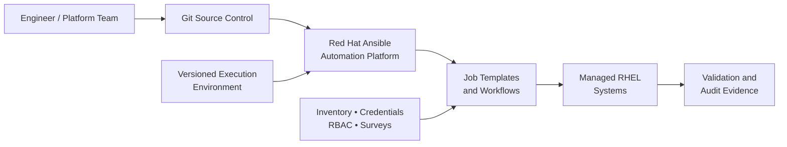

# Enterprise Linux Automation

Production-inspired reference implementation for governed enterprise RHEL
automation using Red Hat Ansible Automation Platform (AAP).

This project demonstrates how enterprise Linux automation can move beyond
individually executed scripts and playbooks into a controlled operating model
built around reusable Ansible content, source control, standardized Execution
Environments, managed credentials, structured inventories, runtime controls,
validation, and auditable execution.

> This is an independently developed reference implementation using synthetic
> infrastructure data. It does not contain employer, customer, or production
> configurations.

---

## Why this project exists

Writing an Ansible playbook is only one part of enterprise automation.

At scale, platform teams must also address:

- Who is allowed to execute automation?
- Which credentials may be used?
- Which systems may be targeted?
- Which version of automation content is approved?
- Which runtime dependencies are trusted?
- How are production changes controlled?
- How is execution validated?
- How can actions be traced and audited?

This repository demonstrates those concerns as parts of one automation
operating model rather than treating automation as isolated scripts.

---

## Architecture



The design separates **automation content**, **execution runtime**,
**authentication**, **target selection**, and **execution control**.

This allows each layer to be governed independently.

For more detail, see [Architecture](docs/architecture.md).

---

## Automation operating model

```text
Engineer
   |
   v
Git-controlled automation content
   |
   v
AAP Project
   |
   +---- Versioned Execution Environment
   |
   +---- Managed Inventory
   |
   +---- Managed Credentials
   |
   +---- RBAC / Surveys / Runtime Controls
   |
   v
Job Template / Workflow
   |
   v
Controlled execution
   |
   v
Managed RHEL systems
   |
   v
Validation and audit evidence
```

The objective is simple:

**Make the safe path the easy path.**

Engineers should be able to automate quickly without bypassing runtime,
identity, authorization, inventory, validation, or change-control standards.

See [Enterprise Automation Operating Model](docs/operating-model.md).

---

## Repository structure

```text
enterprise-linux-automation/
|
├── inventories/
│   └── enterprise/
│       ├── inventory.yml
│       ├── group_vars/
│       ├── host_vars/
│       └── README.md
│
├── roles/
│   ├── enterprise_linux_baseline/
│   ├── enterprise_service_management/
│   └── enterprise_ssh_baseline/
│
├── playbooks/
│   ├── enterprise_linux_baseline.yml
│   ├── enterprise_linux_baseline_validate.yml
│   ├── runtime_maintenance_request.yml
│   ├── inventory_architecture_validation.yml
│   ├── connectivity_check.yml
│   ├── post_validation.yml
│   ├── scm_validation.yml
│   ├── survey_connectivity_check.yml
│   ├── variable_precedence.yml
│   ├── vault_validation.yml
│   └── failure-handler.yml
│
├── execution-environment/
│   ├── execution-environment.yml
│   ├── requirements.yml
│   ├── requirements.txt
│   ├── bindep.txt
│   └── README.md
│
├── collections/
│   └── requirements.yml
│
├── docs/
│   ├── architecture.md
│   └── operating-model.md
│
├── vars/
│   └── secure.yml.example
│
├── ansible.cfg
└── README.md
```

---

## Inventory architecture

The reference inventory models systems across several enterprise dimensions:

| Dimension | Examples |
|---|---|
| Environment | `env_production`, `env_development` |
| Application tier | `role_web`, `role_app`, `role_database` |
| Region | `region_us_east_1` |
| Operating system | `os_rhel9` |
| Application | `app_payments`, `app_shared_services` |

A host can participate in multiple groups simultaneously.

For example, a system may be:

```text
production
+ web tier
+ RHEL 9
+ us-east-1
+ payments application
```

This allows automation behavior to be composed from operational context rather
than duplicating host definitions.

All addresses and infrastructure identifiers in the repository are synthetic.

---

## Reusable automation roles

### `enterprise_linux_baseline`

Provides foundational RHEL configuration including:

- RHEL platform validation
- Required package installation
- Enterprise directory creation
- Managed system configuration files
- Baseline operating-system configuration

### `enterprise_service_management`

Provides declarative service-state management for services owned by the
platform baseline.

### `enterprise_ssh_baseline`

Applies SSH configuration controls using a safety-oriented handler pattern:

```text
Configuration change
       |
       v
sshd configuration validation
       |
       +---- invalid --> fail without reload
       |
       v
reload sshd
```

This reduces the risk of deploying an invalid SSH configuration that could
affect administrative access.

---

## Execution Environment

Automation executes through a version-controlled custom Execution Environment.

Current runtime includes:

| Component | Version |
|---|---:|
| AAP minimal RHEL 9 EE stream | 2.16 |
| `redhat.rhel_system_roles` | 1.120.5 |
| `amazon.aws` | 11.4.0 |
| `ansible.posix` | 2.2.0 |
| `community.general` | 13.3.0 |
| `boto3` | 1.42.91 |
| `botocore` | 1.42.91 |
| `aiobotocore` | 3.5.0 |

This prevents automation behavior from depending on whatever libraries happen
to exist on an engineer's workstation.

The runtime itself therefore becomes a controlled artifact.

See [Execution Environment documentation](execution-environment/README.md).

---

## Credential and secret handling

Secrets are intentionally separated from automation content.

The repository does not store:

- SSH private keys
- Machine passwords
- Vault passwords
- Registry passwords
- Automation Hub token values
- Cloud access keys

AAP Machine Credentials should supply managed-node authentication.

Sensitive Ansible variables should be encrypted with Ansible Vault or supplied
through an approved enterprise secrets-management mechanism.

A safe example structure is provided in:

```text
vars/secure.yml.example
```

Local secret files and generated Execution Environment build context are
excluded from Git.

---

## Runtime governance example

`runtime_maintenance_request.yml` demonstrates validation of operational input
before a maintenance action is accepted.

Controls include:

```text
Requested target environment
            |
            v
Validate environment value
            |
            v
Compare request with inventory environment
            |
            v
Validate maintenance action
            |
            v
Validate change reference
            |
            v
Evaluate reboot authorization
            |
            v
Proceed with approved execution path
```

The current patch path is intentionally a reference/simulation workflow rather
than a claim of complete production patch execution.

A dedicated controlled patch-management implementation can be added as a
separate lifecycle capability.

---

## Validation model

The repository separates implementation from validation.

Examples include:

- OS/platform validation
- directory validation
- configuration-file validation
- service-state validation
- SSH configuration validation
- inventory architecture validation
- SCM synchronization validation
- connectivity validation
- variable-precedence validation

This pattern supports:

```text
Change
  -> Execute
  -> Validate
  -> Capture result
```

rather than assuming that a successful Ansible task automatically proves the
desired operational state.

---

## AAP implementation model

In Red Hat Ansible Automation Platform, the repository is intended to map to
platform objects such as:

```text
Organization
   |
   +-- Project
   |
   +-- Inventory
   |
   +-- Credentials
   |
   +-- Execution Environment
   |
   +-- Job Templates
   |
   +-- Workflow Job Templates
   |
   +-- RBAC
   |
   +-- Surveys
   |
   +-- Notifications / Audit History
```

Git controls the automation content.

AAP controls **how, where, by whom, and with which credentials that automation
is executed**.

---

## Example execution flow

A baseline deployment can follow this pattern:

```text
1. Engineer updates automation content
2. Change is reviewed in source control
3. AAP Project synchronizes approved content
4. Job Template selects the approved Execution Environment
5. AAP provides managed Inventory and Credentials
6. Runtime controls validate operator input
7. Automation executes against approved systems
8. Post-change validation confirms expected state
9. AAP retains execution history and result evidence
```

---

## Design principles demonstrated

This project is built around several enterprise automation principles:

**Reusable content**  
Business logic belongs in roles rather than being repeatedly embedded in
playbooks.

**Runtime consistency**  
Execution Environment dependencies are version-controlled.

**Least exposure of credentials**  
Authentication material is kept outside source control.

**Inventory as architecture**  
Hosts are modeled across environment, application, role, region, and operating
system dimensions.

**Fail before unsafe change**  
Input and configuration validation occur before sensitive execution paths.

**Separation of execution and validation**  
Desired-state verification is treated as an explicit automation capability.

**Platform governance**  
AAP provides the control plane around source-controlled Ansible content.

---

## What this repository demonstrates

The project brings together:

```text
Enterprise Linux Engineering
            +
Ansible Automation
            +
Red Hat AAP
            +
Platform Engineering
            +
Runtime Standardization
            +
Credential Governance
            +
Change Controls
            +
Validation
            +
Auditability
```

The broader objective is not merely to automate individual Linux tasks.

It is to create an automation platform that allows engineering teams to move
faster **without lowering the governance standard**.

---

## Roadmap

Planned enhancements include:

- CI validation for Ansible content
- `ansible-lint`
- YAML linting
- secret scanning
- Execution Environment build validation
- controlled RHEL patch-management role
- workflow-level approval examples
- dynamic cloud inventory examples
- automated compliance validation
- full repository security scanning

---

## Disclaimer

This repository is a synthetic technical reference implementation created for
learning, architecture demonstration, and professional knowledge sharing.

It does not contain proprietary employer or customer automation, credentials,
production host information, or confidential infrastructure configuration.
